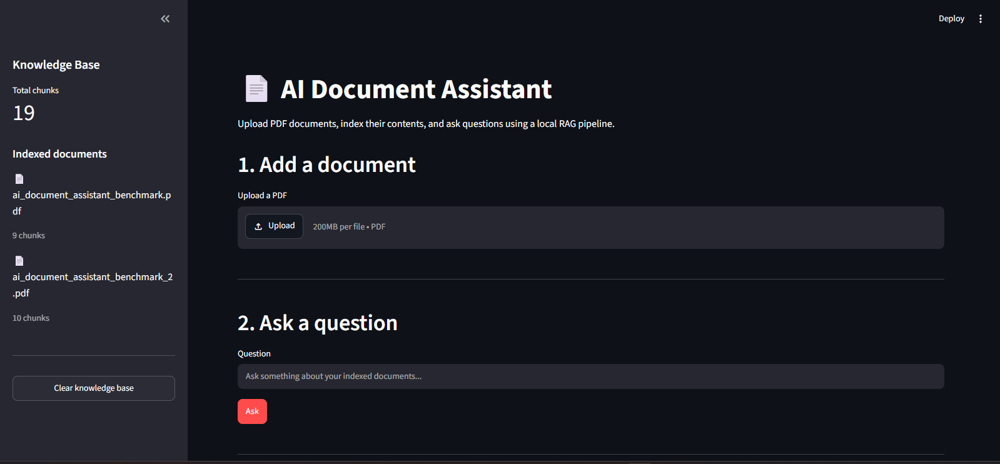
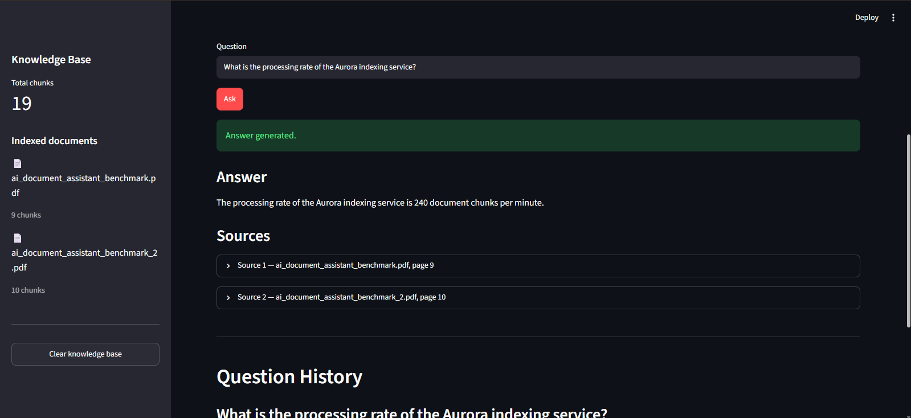
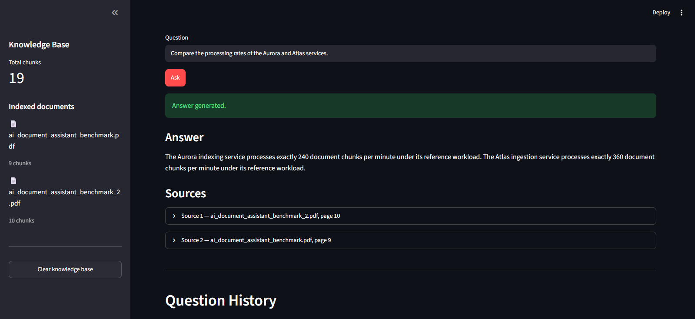

# AI Document Assistant

A fully local Retrieval-Augmented Generation (RAG) application that allows
users to upload PDF documents and ask questions about their contents.

The system extracts text from PDFs, divides the content into overlapping
chunks, generates semantic embeddings, stores them in a local ChromaDB vector
database, retrieves relevant passages using hybrid search, and generates
grounded answers using a local Ollama language model.

The application is designed to run locally without requiring paid cloud APIs.

---

## Features

- Upload and index PDF documents
- Extract text while preserving page numbers
- Split documents into overlapping text chunks
- Generate semantic embeddings locally
- Store embeddings in a persistent ChromaDB database
- Search documents using semantic and lexical relevance
- Encourage source diversity for multi-document retrieval
- Generate answers using a local Ollama language model
- Display source documents and page numbers
- Reject questions that cannot be answered from the indexed documents
- Maintain a local knowledge base across application sessions
- Evaluate retrieval and answer quality with a reproducible benchmark

---

## Architecture

The application follows a Retrieval-Augmented Generation pipeline:

```text
PDF Documents
      |
      v
Text Extraction
      |
      v
Chunking
      |
      v
SentenceTransformer Embeddings
      |
      v
ChromaDB Vector Store
      |
      v
Semantic + Lexical Retrieval
      |
      v
Source-Diverse Selection
      |
      v
Context Construction
      |
      v
Ollama Local LLM
      |
      v
Grounded Answer + Sources
```

The system separates document processing, embeddings, vector storage,
retrieval, context construction, and language-model generation into
independent modules.

---

## Technology Stack

| Component | Technology |
| --- | --- |
| Language | Python |
| User interface | Streamlit |
| PDF processing | PyMuPDF |
| Embeddings | Sentence Transformers |
| Embedding model | all-MiniLM-L6-v2 |
| Vector database | ChromaDB |
| Local LLM runtime | Ollama |
| Language model | qwen2.5:3b |
| Version control | Git |

---

## Project Structure

```text
ai-document-assistant/
|
|-- app/
|   |-- __init__.py
|   |-- document_processor.py
|   |-- embeddings.py
|   |-- llm.py
|   |-- rag.py
|   |-- search.py
|   |-- streamlit_app.py
|   `-- vector_store.py
|
|-- data/
|   |-- chroma/
|   `-- documents/
|
|-- screenshots/
|
|-- tests/
|   |-- __init__.py
|   |-- test_document_processor.py
|   |-- test_embeddings.py
|   |-- test_rag.py
|   |-- test_search.py
|   `-- test_vector_store.py
|
|-- .gitignore
|-- README.md
`-- requirements.txt
```

Local PDFs and the ChromaDB database are excluded from version control.

---

## Document Processing

PDF files are processed with PyMuPDF.

Text is extracted page by page so that each resulting chunk can preserve the
page number from which it originated.

The default chunking configuration is:

```text
Chunk size: 500 words
Overlap:    100 words
```

The overlap helps preserve information that crosses chunk boundaries.

Each stored chunk includes metadata identifying its original source document
and page number.

---

## Embeddings

The project uses the Sentence Transformers model:

```text
all-MiniLM-L6-v2
```

The model generates 384-dimensional embeddings.

Embeddings are generated locally and stored in ChromaDB together with the
document text and metadata.

---

## Vector Database

ChromaDB is used as the persistent local vector database.

The database is stored under:

```text
data/chroma/
```

The application can:

- add document chunks
- search the vector database
- delete chunks belonging to a document
- reset the knowledge base
- count stored chunks
- retrieve document metadata

The database directory is excluded from Git because it is generated locally.

---

## Retrieval

The retrieval pipeline combines semantic similarity with lexical relevance.

For every question, the application:

1. Generates an embedding for the query.
2. Retrieves a larger candidate set from ChromaDB.
3. Filters candidates using a semantic-distance threshold.
4. Measures lexical overlap between the query and each candidate.
5. Re-ranks the candidates using lexical relevance and semantic distance.
6. Selects the final passages while encouraging source diversity.

The application currently uses:

```text
Candidate retrieval: 10 passages
Final context:        2 passages
Maximum distance:     1.35
```

### Source-Diverse Selection

During evaluation, a multi-document retrieval limitation was identified.

A standard top-k search can return multiple highly ranked passages from the
same document even when the question requires information from different
documents.

To improve this behavior, the final retrieval stage encourages source
diversity.

The selection process first attempts to choose relevant passages from
different source documents. If additional results are still required, the
remaining positions are filled using the original relevance ranking.

This is a generic retrieval strategy and does not contain rules for specific
documents, benchmark questions, or entities.

---

## Context Construction

Retrieved passages are converted into a structured context containing:

```text
Source
Page
Document text
```

The context passed to the language model is limited to approximately:

```text
6000 characters
```

This keeps prompts manageable for local inference while preserving the most
relevant retrieved information.

---

## Local Language Model

Answers are generated with Ollama using:

```text
qwen2.5:3b
```

The language model runs locally.

The prompt explicitly instructs the model to:

- use only the retrieved context
- avoid outside knowledge
- avoid inventing information
- keep answers concise
- return a predefined fallback response when the context is insufficient

The fallback response is:

```text
I don't have enough information in the provided document to answer this question.
```

This behavior helps reduce unsupported answers when retrieval does not provide
enough evidence.

---

## Installation

### 1. Clone the repository

```powershell
git clone <repository-url>
cd ai-document-assistant
```

### 2. Create a virtual environment

```powershell
python -m venv .venv
```

### 3. Activate the virtual environment

On Windows PowerShell:

```powershell
.venv\Scripts\Activate.ps1
```

### 4. Install dependencies

```powershell
pip install -r requirements.txt
```

### 5. Install Ollama

Install Ollama separately for your operating system.

Then download the language model:

```powershell
ollama pull qwen2.5:3b
```

Verify that Ollama is available with:

```powershell
ollama list
```

---

## Running the Application

Activate the virtual environment first:

```powershell
.venv\Scripts\Activate.ps1
```

Then run the Streamlit application directly from the `app` directory:

```powershell
cd app
streamlit run streamlit_app.py
```

Streamlit will display the local application URL in the terminal.

> The application is executed directly from `app/streamlit_app.py`. A separate
> root-level Streamlit launcher is not required.

---

## Usage

### 1. Start the application

Run the Streamlit interface.

### 2. Upload a PDF

Select a PDF document from the document-management section.

### 3. Index the document

The application will:

```text
Extract pages
     |
Create chunks
     |
Generate embeddings
     |
Store chunks in ChromaDB
```

### 4. Ask questions

Enter a question about the indexed documents.

The application retrieves the most relevant passages and sends them to the
local language model.

### 5. Review the sources

Generated answers include the retrieved source document and page information
so that the result can be traced back to the indexed material.

---

## Screenshots

### Main Interface

The Streamlit interface provides PDF document management, knowledge-base
information, and a question-answering interface in a single local application.



### Grounded Question Answering

Answers are generated from retrieved document context and include the source
document and page number used during retrieval.



### Multi-Document Retrieval

The retrieval pipeline can combine information from multiple indexed documents.
In this example, the assistant retrieves information from both benchmark
documents to compare the Aurora and Atlas processing rates.



---

## Evaluation

The project includes a reproducible public benchmark designed specifically
for this repository.

The benchmark uses two original, self-authored PDF documents containing
computer science concepts and fictional reference facts.

This provides a controlled evaluation corpus without requiring copyrighted
textbooks or proprietary datasets.

### Benchmark Dataset

The evaluation corpus contains two documents:

```text
ai_document_assistant_benchmark.pdf
ai_document_assistant_benchmark_2.pdf
```

Together, the benchmark corpus contains:

```text
19 indexed chunks
```

The documents cover topics including:

- algorithms and data structures
- relational databases
- computer networks
- operating systems
- machine learning
- retrieval-augmented generation
- software testing
- version control
- distributed systems
- software architecture

The documents also contain fictional benchmark entities including:

```text
Aurora
Atlas
Borealis
Meridian
Cedar
Juniper
```

These fictional facts help test whether answers actually come from the
retrieved documents rather than from general model knowledge.

---

## Benchmark Test Suite

The public benchmark contains 20 questions divided into four groups:

| Category | Questions |
| --- | ---: |
| Document 1 | 5 |
| Document 2 | 5 |
| Multi-document | 5 |
| Irrelevant / out-of-document | 5 |
| **Total** | **20** |

The benchmark measures three main properties.

### Retrieval Accuracy

Checks whether the expected source document or documents were retrieved.

### Answer Accuracy

Checks whether the generated answer contains the information required by the
benchmark.

### Grounded Rejection

Questions intentionally unrelated to the indexed corpus verify that the
assistant returns the fallback response instead of answering from outside
knowledge.

Run the benchmark from the project root:

```powershell
python -m tests.test_rag
```

---

## Benchmark Results

The final public benchmark achieved:

| Metric | Result |
| --- | ---: |
| Retrieval accuracy | **95%** |
| Answer accuracy | **95%** |
| Overall accuracy | **95%** |
| Irrelevant-question rejection | **100%** |

The benchmark demonstrates that the system can:

- retrieve information from individual documents
- answer grounded factual questions
- combine information across multiple documents
- distinguish between available and unavailable information
- reject unrelated questions instead of relying on outside knowledge

### Multi-Document Retrieval Improvement

An earlier evaluation exposed a limitation in standard top-k retrieval.

For one comparison question, both final retrieval positions were occupied by
chunks from the same document. The second document required to answer the
question was therefore missing from the LLM context.

The retrieval pipeline was improved with source-diverse selection.

After the change, the system successfully retrieved information from both
documents for additional multi-document comparisons while maintaining the
same generic retrieval architecture.

### Known Limitation

One of the 20 benchmark questions remains a retrieval failure.

The question requires information from two different documents, but one
required passage does not survive the retrieval candidate filtering stage.

Because the necessary information is missing from the final context, the
language model returns the fallback response rather than inventing the missing
fact.

This limitation is intentionally documented instead of adding
benchmark-specific retrieval rules.

---

## Performance

Inference is performed locally, so response time depends heavily on:

- CPU and available hardware acceleration
- model loading state
- prompt size
- retrieved context size
- generated answer length
- other system activity

Warm queries can complete significantly faster than initial or
prompt-evaluation-heavy queries.

For this reason, benchmark accuracy is treated as the primary evaluation
metric rather than presenting a single response-time measurement as a
hardware-independent performance claim.

---

## Privacy and Local-First Design

The main RAG pipeline is designed to operate locally.

Documents are processed locally, embeddings are generated locally, ChromaDB
runs locally, and answer generation is performed through the local Ollama
runtime.

This architecture can be useful when documents should not be sent to a
third-party inference API.

Local document files and the generated vector database are excluded from
version control.

---

## Limitations

Current limitations include:

- PDF text extraction depends on the structure of the source PDF.
- Scanned PDFs without a text layer require OCR, which is not currently part
  of the pipeline.
- Retrieval quality depends on embedding quality, chunking, and query wording.
- The current local model is relatively small and can occasionally fail to
  use correctly retrieved context.
- Multi-document questions can fail when a required passage does not survive
  candidate retrieval or filtering.
- Local inference speed depends on the available hardware.
- The application currently focuses on PDF documents.

---

## Future Improvements

Possible future improvements include:

- configurable chunking strategies
- larger or alternative embedding models
- cross-encoder re-ranking
- Maximal Marginal Relevance (MMR)
- dynamic retrieval depth
- improved multi-document retrieval
- OCR support for scanned PDFs
- support for additional document formats
- automated benchmark reporting
- additional retrieval metrics
- containerized deployment
- optional GPU acceleration

---

## Requirements

Main Python dependencies:

```text
streamlit==1.62.0
chromadb==1.5.9
sentence-transformers==6.0.0
PyMuPDF==1.28.2
ollama==0.6.2
```

Ollama itself must be installed separately.

---

## Development Status

The project currently includes:

- PDF ingestion
- document chunking
- semantic embeddings
- persistent vector storage
- hybrid retrieval
- source-diverse selection
- local RAG generation
- source attribution
- irrelevant-question rejection
- Streamlit interface
- automated public benchmark

The current benchmark result is:

```text
Retrieval accuracy:            95%
Answer accuracy:               95%
Overall accuracy:              95%
Irrelevant-question rejection: 100%
```

---

## License

No repository license has been selected yet.

Before distributing or relicensing the project, dependency licenses and their
requirements should be reviewed.